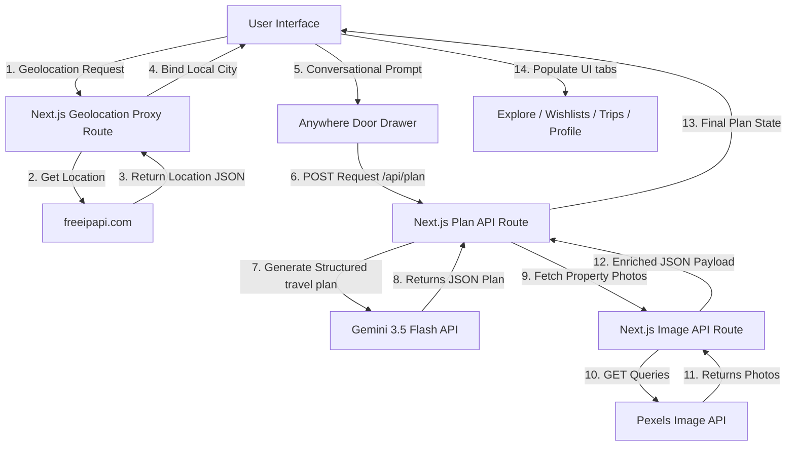

# Airbnb "Anywhere Door" 🚪✨
> **An AI-first reimagining of Airbnb for group travel and zero-friction trip planning.**
> Submitted as a case study prototype for the **OP'26 Product Competition**.

[](https://nextjs.org/)
[](https://react.dev/)
[](https://www.typescriptlang.org/)
[](https://ai.google.dev/)
[](https://opensource.org/licenses/MIT)

---

## 📖 The "Doraemon" Metaphor & Vision

In the classic anime *Doraemon*, the **Anywhere Door** (*Dokodemo Door*) is a magical gadget that immediately transports you to any location you desire. There are no forms to fill, no search filter screens to configure, and no tedious routing procedures—you simply state your destination, turn the knob, and walk through.

### The Problem
Traditional travel booking is plagued by **comparison paralysis** and **friction**. The average traveler spends **4.2 hours** across multiple sessions:
* Toggling between 23+ search filters.
* Reading through hundreds of fragmented reviews.
* Coordinating schedules and split budgets with companions in external group chats.
* Manually researching external maps to draft local day-by-day itineraries.

### The Solution
We reimagined Airbnb around the **Doraemon Principle**: *Remove all friction between user intent and the travel outcome.* 

The **Anywhere Door** is a unified natural language interface embedded in the Airbnb application. By typing a single conversational prompt—such as *"A quiet, remote cabin in the mountains for 4 friends under $250/night, must have a hot tub and fast Wi-Fi for remote work"*—the Gemini-driven backend instantly compiles property recommendations, synthesizes guest feedback into a simple pros-and-cons summary, drafts a curated local itinerary, and calculates the exact per-person cost breakdown.

---

## 🌟 Key Features

* 🗣️ **Conversational Travel Assistant:** A natural language input bar that parses complex group constraints, budgets, preferences, and amenities in a single prompt.
* 🏡 **AI Property Matchmaker:** A curated ranking of properties with automated review summaries (pros & cons) and live amenity matching (Gemini 2.5 Flash + Pexels visual assets).
* 🗓️ **Tailored Daily Itineraries:** A custom day-by-day activity plan tailored to the user's travel style, group size, and location (displayed dynamically in the **Trips** tab).
* 💰 **Smart Budget & Split Billing:** An automated per-person split billing sheet and cost categorizer to streamline group bookings.
* 🌓 **Responsive Theme Engine:** Support for **System Default**, **Light**, and **Dark** modes via React Context.
* 🗺️ **CORS-Free Geolocation Proxy:** A custom server-side API proxy (`/api/geolocation`) that bootstraps the user's local city during initial load, avoiding client-side CORS issues.
* 📱💻 **Dual-Mode Responsive Design:**
  * **On Mobile:** Wraps the experience in a native-looking iOS/Android phone shell with bottom navigation bars and native status overlays.
  * **On Desktop:** Expands the layout to a full-screen grid, centering menus and moving the Anywhere Door and filters into right-side slide-out panels.

---

## 📊 Strategy Presentation Slide Deck (`/deck`)
A 6-slide product strategy deck is built directly into the Next.js app route `/deck`. 
* **Interactive HTML/CSS Slide Deck:** Styled dynamically to match the premium theme.
* **One-Click PDF Export:** Features a print controller with custom `@media print` style sheets. By clicking the **Export PDF** button, the slide deck renders into a landscape PDF with pages separated cleanly.
* **Slides Overview:**
  1. **Problem:** Travel planning friction statistics ($9.6B lost in booking drop-offs).
  2. **Why GenAI:** Explaining the Doraemon Principle vs. traditional ML.
  3. **User Segments:** Group Travelers, Business Nomads, and First-time Internationals.
  4. **Solution Deep Dive:** Anywhere Door floating companion, curated matches, auto-itinerary, and splits.
  5. **Success Metrics:** Target KPIs (+22% booking conversion, +18% booking value, <8m time-to-book).
  6. **Pitfalls & Mitigations:** Proactive strategies for Hallucinations, Latency, Privacy, and API Costs.

---

## 🛠️ Tech Stack & Architecture

### Stack
* **Frontend:** Next.js 15 (App Router), React 19, Lucide Icons
* **Styling:** CSS variables, Vanilla CSS (ensuring theme tokens, fluid responsiveness, and transitions)
* **AI Engine:** Google Gemini SDK (`gemini-3.5-flash` for high-speed structured JSON output)
* **Images API:** Pexels API Integration (for fallback dynamic listing image fetching)
* **Environment Configuration:** Dotenv variables with server-side next.js api protection

### Architecture Flowchart



---

## 📁 Repository Structure

```
.
├── airbnb-anywhere-door/     # Next.js 15 source code
│   ├── public/               # Static assets & brand icons
│   ├── src/
│   │   ├── app/              # Next.js App Router (pages & API routes)
│   │   ├── components/       # AnywhereDoor chatbot & ListingCard components
│   │   ├── context/          # Global React Context (Theme Engine)
│   │   └── hooks/            # Custom hooks (image preloaders)
│   ├── package.json          # Dependency configurations
│   ├── tsconfig.json         # TS compiler configurations
│   └── vercel.json           # Vercel routing configs
├── case-study/
│   └── OP'26 Product.pdf     # 6-Slide Strategy Pitch Deck (PDF)
├── .gitignore                # Root gitignore rules
└── README.md                 # Root portfolio landing page (this file)
```

---

## 🚀 Setup & Installation

Follow these steps to run the Next.js prototype application locally.

### 1. Clone the Repository
```bash
git clone https://github.com/iaryan08/airbnb-anywhere-door.git
cd airbnb-anywhere-door/airbnb-anywhere-door
```

### 2. Install Dependencies
Using **pnpm** (recommended):
```bash
pnpm install
```
*Or using npm/yarn:*
```bash
npm install
```

### 3. Configure Environment Variables
Create a file named `.env.local` inside the `airbnb-anywhere-door/` folder and populate it with your API keys:
```env
GEMINI_API_KEY=your_gemini_api_key_here
PEXELS_API_KEY=your_pexels_api_key_here
```
> 💡 *Note: You can obtain a free Gemini API key from [Google AI Studio](https://aistudio.google.com/), and a free Pexels key from the [Pexels Developer Portal](https://www.pexels.com/api/).*

### 4. Run the Development Server
```bash
pnpm run dev
```
*Or using npm:*
```bash
npm run dev
```
Open **[http://localhost:3000](http://localhost:3000)** in your browser. 
* To view the Airbnb Anywhere Door mockup, access the home path `/`.
* To view and export the Strategy Presentation Deck, navigate to `/deck`.

### 5. Build for Production
```bash
pnpm run build
pnpm run start
```

---

## 🎯 Verification & Build Status

The application has been verified using a clean compiler pass. 

* **TypeScript Compilation:** Passed with 0 errors.
* **Next.js Static Generation:** All pages (Explore and Slide Deck `/deck`) pre-rendered successfully.
* **API Dynamic Routes:** `/api/geolocation`, `/api/images`, and `/api/plan` resolved as dynamic server routes.
